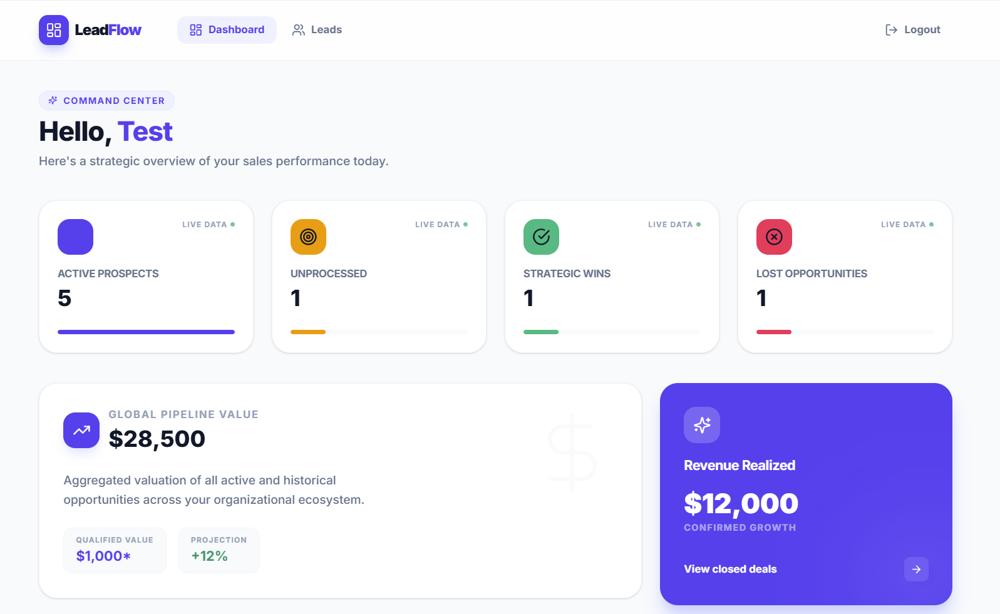
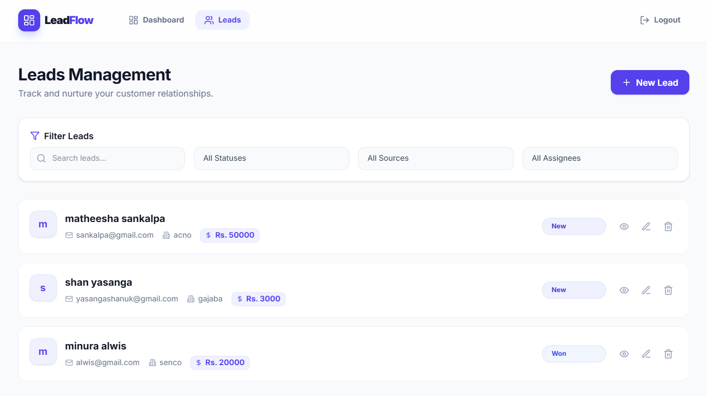

# LeadFlow CRM

A modern, high-performance CRM system built with Next.js and Node.js. Track leads, manage sales pipelines, and monitor team performance with a clean, professional interface.

## 🚀 Features

- **Strategic Dashboard**: Real-time overview of sales performance and revenue metrics.
- **Lead Intelligence**: Comprehensive lead management with status tracking and source analysis.
- **Pipeline Management**: Visual status updates for every stage of the sales funnel.
- **Nurture Notes**: Collaborative note-taking system for customer interactions.
- **Professional UI**: Clean, light-themed aesthetic with a focus on readability and efficiency.

## 📸 Preview

| Dashboard | Leads Management |
|-----------|------------------|
|  |  |


## 🛠 Tech Stack

- **Frontend**: Next.js 14, Tailwind CSS, Lucide Icons
- **Backend**: Node.js, Express
- **Database**: MongoDB (Mongoose)
- **Authentication**: JWT-based session management

## 📦 Setup Instructions

### Prerequisites

- Node.js (v18 or higher)
- MongoDB account (Atlas or local)

### 1. Clone the Repository

```bash
git clone https://github.com/Yasanga32/crm.git
cd crm
```

### 2. Backend Setup

1. Navigate to the server directory:
   ```bash
   cd server
   ```
2. Install dependencies:
   ```bash
   npm install
   ```
3. Configure environment variables:
   Create a `.env` file in the `server` folder (see [Environment Variables](#environment-variables)).
4. Seed demo data (optional):
   ```bash
   npm run seed
   ```
5. Start the server:
   ```bash
   npm run dev
   ```

### 3. Frontend Setup

1. Navigate to the client directory:
   ```bash
   cd ../client
   ```
2. Install dependencies:
   ```bash
   npm install
   ```
3. Configure environment variables:
   Create a `.env.local` file in the `client` folder.
4. Start the development server:
   ```bash
   npm run dev
   ```

## 🔐 Environment Variables

### Server (`/server/.env`)

| Variable | Description | Default |
|----------|-------------|---------|
| `PORT` | Backend port | `5000` |
| `MONGODB_URL` | MongoDB connection string | - |
| `JWT_SECRET` | Secret key for JWT signing | - |
| `NODE_ENV` | Environment mode | `development` |

### Client (`/client/.env.local`)

| Variable | Description | Default |
|----------|-------------|---------|
| `NEXT_PUBLIC_API_URL` | URL of the backend API | `http://localhost:5000/api` |

## 🧪 Demo Credentials

If you ran the seeder, you can log in with:
- **Email**: `admin@example.com`
- **Password**: `password123`
